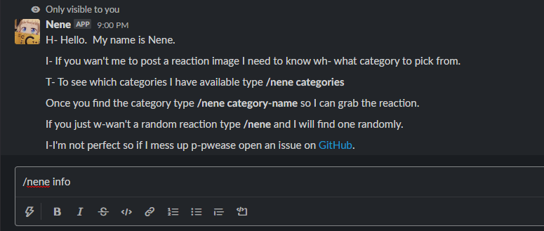
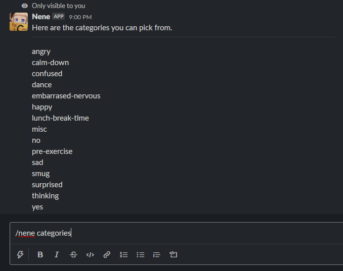
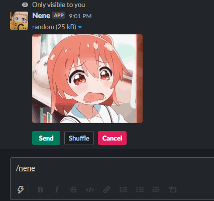
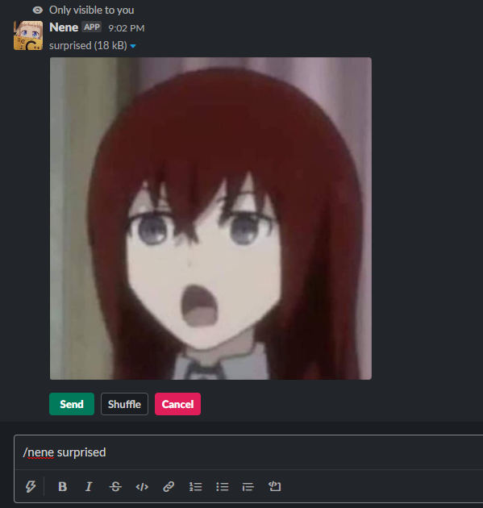
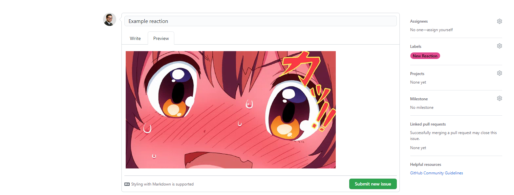

# Anime Reaction API

An API/Slack Bot to serve image links of anime reactions

## Technologies Used

- Node.js v8.0.0 or higher
- Express
- Express Promise Router
- Mocha
- Chai
- Chai-Http
- Dotenv

## Table Of Contents

- [How to use](#how-to-use)
- [How to use on Slack](#how-to-use-on-slack)
- [Contributing Reactions](#contributing-reactions)
- [Development](#development)

## How to use

All requests must be sent to the following base url:

`https://anime-reactions.uzairashraf.dev/`

### Categories

To send a request to the api, you will need a category to specify, you may also use the [random endpoint](#random-reactions) if you do not wish to use a category.  This endpoint is used to see all available categories.

- Method: **GET**
- Path: `/api/categories`
- Query Parameters: `none`
- Response:
  ```js
  ["angry", "calm-down", "confused", "dance", "embarrased-nervous", "happy", "imdumb", "lunch-break-time", "misc", "no", "pre-exercise", "sad", "smug", "surprised", "thinking", "yes"]
  ```

Example request using async await and fetch:
```js
  const myFunc = async () => {
    const response = await fetch('https://anime-reactions.uzairashraf.dev/api/categories')
    const data = await response.json()
    console.log(data)
  }
  myFunc()
```

Example request using async await and axios:
```js
  const myFunc = async () => {
  const response = await axios.get('https://anime-reactions.uzairashraf.dev/api/categories')
  console.log(response.data)
  }
  myFunc()
```

Example request using Ajax:
```js
  $.ajax({
    url: 'https://anime-reactions.uzairashraf.dev/api/categories',
    method: 'GET',
    success: console.log
  })
```

### Reactions

This endpoint will give you a response of **all** the reactions pertaining to a category.

- Method: **GET**
- Path: `/api/reactions`
- Query Parameters: `category`
- Response:
  ```js
  ["https://anime-reactions.uzairashraf.dev/angry/angry-1.jpg", "https://anime-reactions.uzairashraf.dev/angry/angry-2.gif", "https://anime-reactions.uzairashraf.dev/angry/mad.png", "https://anime-reactions.uzairashraf.dev/angry/pou6.gif", "https://anime-reactions.uzairashraf.dev/angry/pout-7.gif", "https://anime-reactions.uzairashraf.dev/angry/pout.gif", "https://anime-reactions.uzairashraf.dev/angry/pout.jpg", "https://anime-reactions.uzairashraf.dev/angry/pout.png", "https://anime-reactions.uzairashraf.dev/angry/pout2.jpg", "https://anime-reactions.uzairashraf.dev/angry/pout3.jpg", "https://anime-reactions.uzairashraf.dev/angry/pout4.png", "https://anime-reactions.uzairashraf.dev/angry/pout5.jpg", "https://anime-reactions.uzairashraf.dev/angry/pout6.png", "https://anime-reactions.uzairashraf.dev/angry/pout7.jpg", "https://anime-reactions.uzairashraf.dev/angry/tickled.png"]
  ```

Example request using async await and fetch:
```js
  const myFunc = async () => {
    const response = await fetch('https://anime-reactions.uzairashraf.dev/api/reactions?category=angry')
    const data = await response.json()
    console.log(data)
  }
  myFunc()
```

Example request using async await and axios:
```js
  const myFunc = async () => {
        const response = await axios.get('https://anime-reactions.uzairashraf.dev/api/reactions', {
          params: {
            category: 'angry'
          }
        })
        console.log(response.data)
      }
      myFunc()
```

Example request using Ajax:
```js
  $.ajax({
    url: 'https://anime-reactions.uzairashraf.dev/api/reactions',
    method: 'GET',
    data: {
      category: 'angry'
    },
    success: console.log
  })
```

### Random Reactions

This endpoint will give you a response of a **random** reaction pertaining to the category. If a category is not supplied it will give you a response of a **random** reaction in any of the categories

- Method: **GET**
- Path: `/api/reactions/random`
- Query Parameters: `category` **( OPTIONAL )**
- Response:
  ```js
  {reaction: "https://anime-reactions.uzairashraf.dev/angry/pout.gif", category: "angry"}
  ```

Example request using async await and fetch:
```js
  const myFunc = async () => {
    const response = await fetch('https://anime-reactions.uzairashraf.dev/api/reactions/random?category=angry')
    const data = await response.json()
    console.log(data)
  }
  myFunc()
```

Example request using async await and axios:
```js
  const myFunc = async () => {
        const response = await axios.get('https://anime-reactions.uzairashraf.dev/api/reactions/random', {
          params: {
            category: 'angry'
          }
        })
        console.log(response.data)
      }
      myFunc()
```

Example request using Ajax:
```js
  $.ajax({
    url: 'https://anime-reactions.uzairashraf.dev/api/reactions/random',
    method: 'GET',
    data: {
      category: 'angry'
    },
    success: console.log
  })
```
---

## How to use on Slack


  ### Add to your workspace :arrow_down:

  <a href="https://slack.com/oauth/v2/authorize?client_id=866554587907.1252054984657&scope=commands&user_scope=">
  
  </a>

  ### Commands

  - **/nene info**

    Displays information about the bot, and which commands are available.

    

  - **/nene categories**

    Displays a list of categories available to use when generating a reaction.

    

  - **/nene**

    Generates a random reaction. Reaction is random every time you shuffle as well.

    

  - **/nene (category-name)**

    Generates a random reaction based off of the category.

    

---

## Contributing Reactions

The anime reactions api is open source and relies heavily on community images.  You are free to make categories on your own. If they are relevant and make sense, then they will be merged into the repository.  **NSFW** images will not be allowed.

### Steps to Contribute:

1. Open an issue

    - Your title should be the name of the reaction
    - Your description should be an image of the reaction(s)
    - Select the `New Reaction` label along with the `New Category` label if you are adding a category as well

    

1. Create a branch

    - Your branch name should be your issue number and the name of your reaction.

      Example: `issue-001-example-reaction`

1. Add your image

    - Add your image to folder pertaining to your category.  Your image name must use kebab case followed by a number if there is already an image with that name.

      Example: `reaction-4.png`

1. Open a pull request

    - Your title should be the issue number with the name of the reaction

    - Your description should be an image of the reaction(s)

    - Open the pull request to the master branch

---

## Development

The anime reactions api practices test driven development.  Any changes made to an endpoint will also require a refactor to the test if needed.  You can find the tests in `test/test.js`.  Any new endpoints added will also require a test associated with it.

### Getting started

1. Clone the repository

    ```bash
    git clone https://github.com/uzair-ashraf/anime-reaction-api.git
    ```

2. Install dependencies

    ```bash
    npm install
    ```

3. Copy the configuration file for the environment variables

    ```bash
    sudo cp .env.config .env
    ```

4. Run the development server

    ```bash
    npm run dev
    ```

5. After changes run the tests

    ```bash
    npm run test
    ```

### Making changes to the repository

Any changes to the repository requires you to open an issue and a pull request

1. Open an issue

    - Your title should be the name of the change
    - Your description should be a description of your changes
    - Select the appropriate label(s)
      - Bug - when fixing a bug
      - Documentation - when updating the documentation
      - Enhancement - When refining an existing endpoint
      - Feature - When adding a new endpoint

2. Create a branch

    - Your branch name should be your issue number and the name of your reaction.

      Example: `issue-001-bug-fix`

3. Open a pull request

    - Your title should be the issue number with the name of the change

    - Your description should a description of your changes

    - Open the pull request to the master branch
